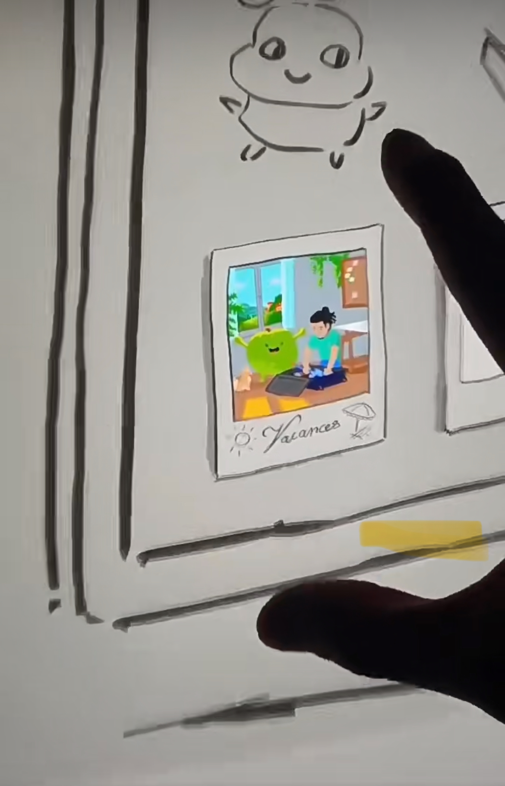
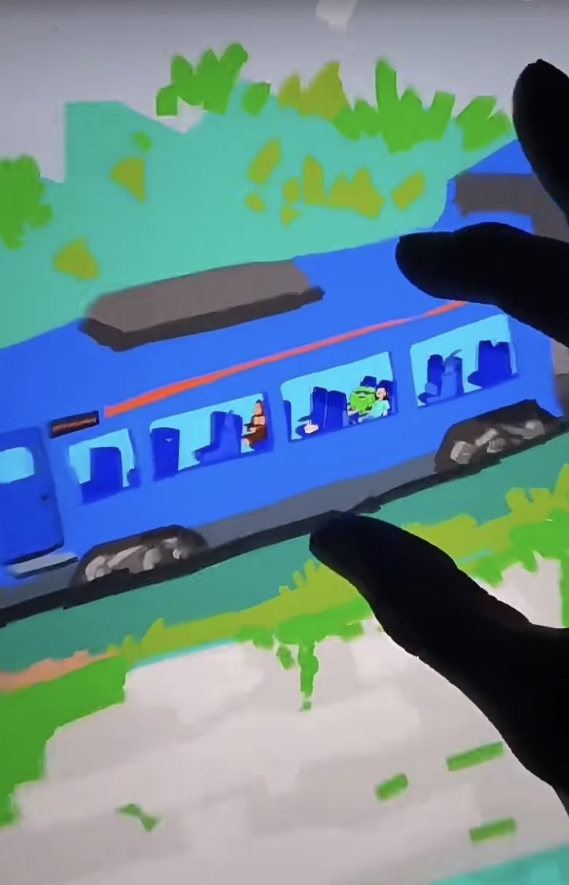
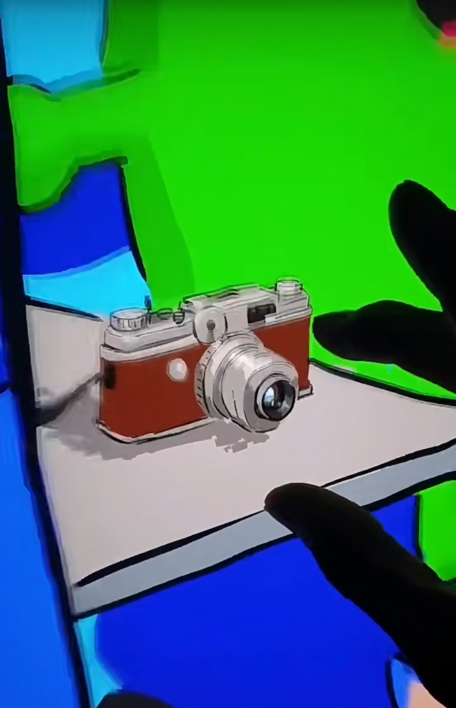
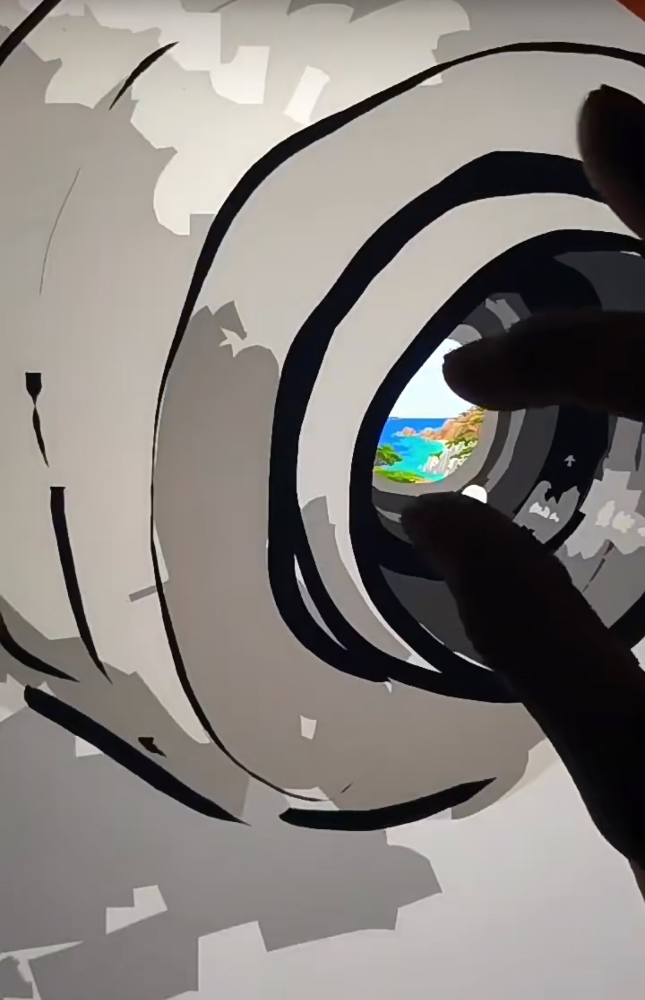
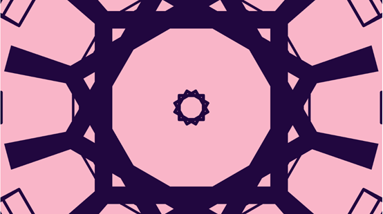

# jhan0884_9103_tut1
## Jiangpiaoyue HAN
### quiz8
#### Part1
The art technique of "picture in picture" is an important inspiration for my assignment. This inspiration comes from a form of painting that has emerged in recent years, in which the viewer can continuously zoom in on a certain part of the work, each time discovering a completely new picture. This artistic expression not only adds layers to the work, but also allows viewers to gradually reveal hidden details during exploration. This dynamic and progressive visual experience is exactly what I hope to achieve in my work, by leading the user to explore new content and creating richer interactive effects.

[Link of Art](http://xhslink.com/a/TcO4UvYMDZuW)

#### Part2
This reminds me of the Orbit Control technology in p5.js to zoom and rotate the Angle of view through interactive actions such as mouse scrolling, allowing users to view different parts of the screen in a dynamic manner. This technology makes the display of the picture more flexible, and users can freely adjust the Angle of view, so that they can feel the details of the scene more intuitively. Through natural interactions, Orbit Control provides an easy and effective way for users to acquire new visual experiences during exploration, enhancing interactions.
[Link of Inspiration](https://p5js.org/zh-Hans/examples/3d-orbit-control/)

